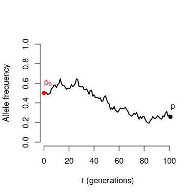
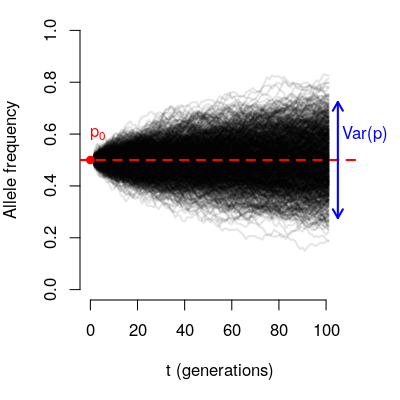
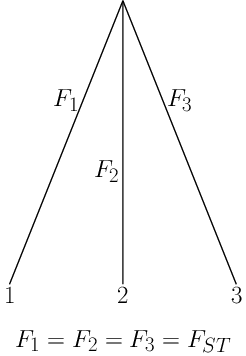
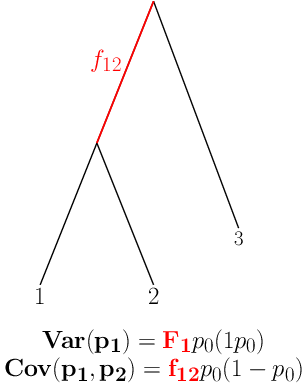
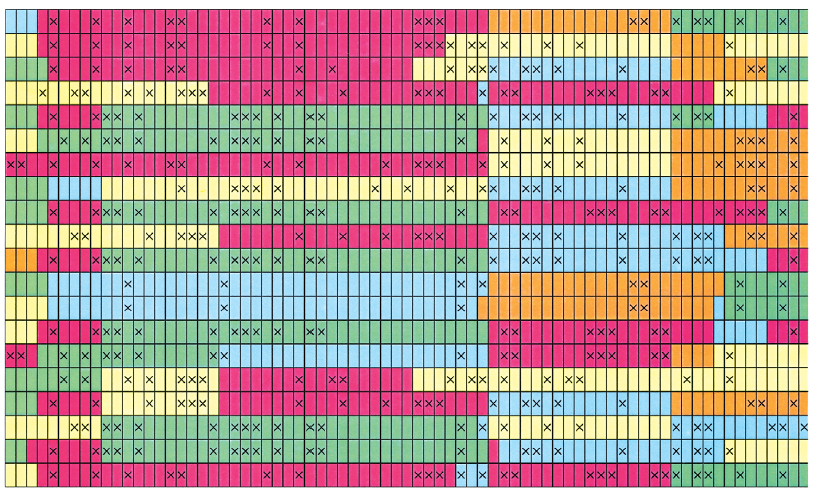
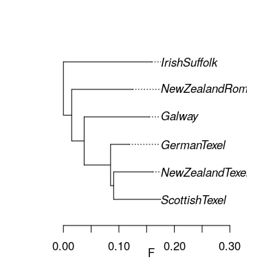
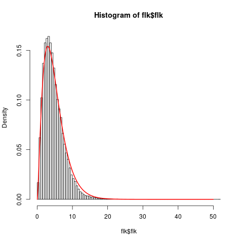
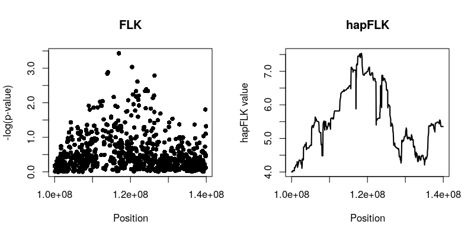
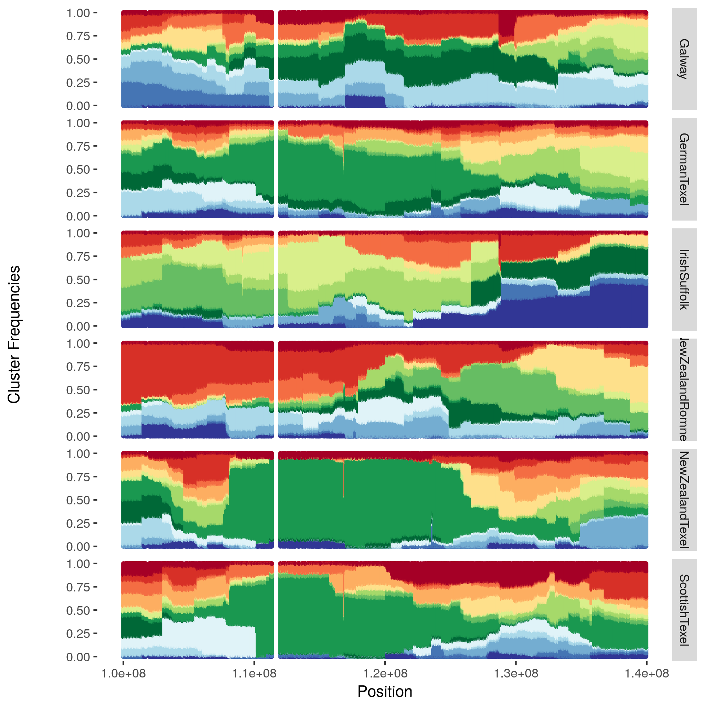
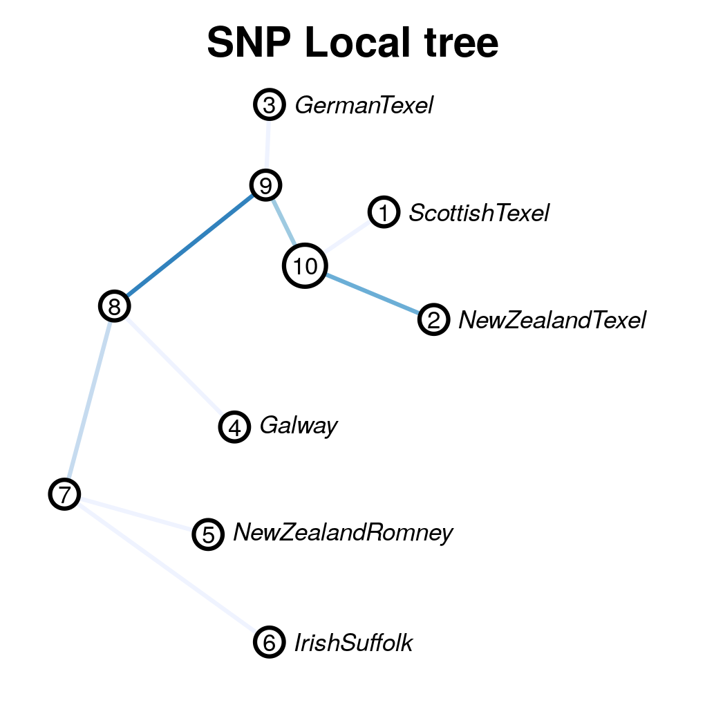

This tutorial explains the basics of the tests and includes a practical to try the software on a part of the dataset used in Fariello et al. (2013)

## Principle of the (hap)FLK tests

-   FLK and hapFLK are tests aimed at detecting selection based on
    population differentiation
    
-   The principle is:
    1. **Model  differences in allele frequencies** betwen a
       group of populations evolving under drift.
    
    2. At a given locus: **Are observed differences with this model ?** = test for selection at this locus.
    
    3. Single SNP test: FLK / LD-based test : hapFLK
    
       

### Neutral model in a single population

Consider the trajectory of an allele through time in a population of
finite size



If we were to look at many loci starting from the same initial
frequency $p_0$​.




$$E(p) = p_0$$

The variance of the final frequencies depends on:

-   The number of generations (t)
-   The population size (N)
-   The initial allele frequency ($p_0$)

$$Var(p) \approx \frac{t}{2N} p_0(1-p_0)$$

### Neutral model in multiple populations

If we had a set of loci with identical $p_0$:

-   we could estimate $F \approx \frac{t}{2N}$ and
-   characterize the distribution of allele frequencies under Neutral
    evolution.

**Considering the same locus in a set of populations achieves this.**



$F$ characterizes the amount of drift since ancestral split:
shared across (neutral) loci:  estimated by considering all loci.


### A more general scenario

-   Populations have different sizes
-   Successive splits: some populations share ancestry **after** the
    ancestral population.




### Exploiting Linkage Disequilibrium: hapFLK



-   hapFLK uses the  [Scheet and Stephens LD model](https://www.ncbi.nlm.nih.gov/pubmed/16532393) .
-   Models local similarity between haplotypes via reduction of
    dimension: **local haplotype clusters**
-   Definition of clusters change along the chromosome: accounts for the
    effects of recombination


### The hapFLK test

-   Principle:
    -   Consider clusters as alleles
    -   Estimate haplotype cluster frequencies
    -   Test if differences in allele frequencies fit a neutral model.
-   Advantages of using this LD model:
    -   No need for sliding windows
    -   Can be estimated on unphased genotype data
    -   Admits missing data
-   **The null distribution of hapFLK is not known but can be approximated from the data**


# Software overview

-   `hapflk` is a python program that is meant to be used on the command
    line.
-   Input files should be in `plink` format. Preferably binary
    `{bed,bim,fam}` files.
-   First column (FID column) must indicate the population of origin
    of an individual


# Practical

For this practical we will analyse data from
[The SheepHapMap project](http://www.sheephapmap.org/hapmap.php). First download the data:

```bash
mkdir -p practical/hapflk/data/
## get input files into practical directory (TODO)
wget -P practical/hapflk/data http://genoweb.toulouse.inra.fr/~servin/data/NEU.fam
wget -P practical/hapflk/data http://genoweb.toulouse.inra.fr/~servin/data/NEU.bim
wget -P practical/hapflk/data http://genoweb.toulouse.inra.fr/~servin/data/NEU.bed
```

-   These data consists in 7 populations from Northern Europe.
-   One of them, the Soay, will be considered as an outgroup.


## Single SNP analysis : estimate kinship and compute FLK

The first task will be aimed at running hapflk in SNP mode, to:

-   calculate allele frequency
-   estimate genetic distances between populations (Fsts)
-   build a population tree
-   Calculate FLK tests

This is done by running:

```bash
hapflk --bfile practical/hapflk/data/NEU --outgroup=Soay -p practical/hapflk/NEU
```

Which should take ~ 2 minutes.

This leads to the following output files:

```bash
ls practical/hapflk/NEU*
```

Let's look at  the population tree (`NEU_tree.txt`).

```R
library(ape)
neu.t=read.tree('practical/hapflk/NEU_tree.txt')
plot(neu.t,align=T)
axis(1,line=1.5)
title(xlab='F')
```

Notice that the outgroup (Soay) has been removed.



The kinship file contains the (co)variance matrix of allele
frequencies estimated with all SNPs.

The `NEU.flk` file contains results of the FLK test.

We can check the fit of the model by verifying that the empirical
distribution of FLK is close to a $\chi^2(5)$

```R
flk=read.table('practical/hapflk/NEU.flk',h=T)
hist(flk$flk,n=100,f=F)
xx=seq(0,50,0.01)
lines(xx,dchisq(xx,df=5),lwd=2,col=2)
```




## LD analysis : compute hapFLK

- hapFLK is a test based on LD patterns.

- LD patterns are relevant for linked markers

- So hapFLK needs to be calculated independently for each chromosome :)

-   To reduce computation time, we will practice on a small, non random
    region of a chromosome
    
-   We use plink to create our reduced dataset:

    ```shell
    plink --sheep --bfile practical/hapflk/data/NEU \
          --chr 2 --from-kb 100000 --to-kb 140000\
          --out practical/hapflk/data/mstn --make-bed
    ```


###  an hapFLK run

As for FLK, hapFLK must be calculated using a kinship matrix
**estimated genome-wide**.

When using the LD model, the kinship **must** be provided.

hapFLK calculations are turned on by setting a number of haplotype
clusters using the `-K` flag.

```shell
hapflk --bfile practical/hapflk/data/mstn \
			 --legacy \
       --outgroup=Soay \
       -p practical/hapflk/mstn \
       --annot \
       --kinship practical/hapflk/NEU_fij.txt \
       -K 15 \
       --nfit=2 \
       --ncpu=2
```

-   **-K 15**: the number of clusters to model LD. This **depends on the
    data**. Can be estimated using [`fastPHASE`](http://scheet.org/software.html) cross-validation
    proceudre.
-   **&#x2013;annot**: turn on the production of output files  to
    annotate the FLK and hapFLK signal. Use when looking at small
    genomic regions (some files can get big !).
-   **&#x2013;nfit=2**: this is only used here to reduce computation
    time. **Don't do this at home** (keep the default unless you know what
    you are doing).
-   **&#x2013;ncpu=2**: use more if you can.
-   **--legacy** : this uses the original procedure to fit the LD model. In this practical we will stick to this way of doing it. See the general documentation on using an updated procedure.


### hapFLK output files

```shell
$ls practical/hapflk/mstn*
```

-   `mstn.flk` and `mstn.frq`: same as before. Sometimes useful (not here).
-   `mstn.hapflk`: contains the hapFLK results
-   `mstn.kfrq.fit_{N}.bz2`: frequency of haplotype clusters in
    populations
-   `mstn.rey`: estimates of local $F_{_ST}$ between populations
-   `mstn.*.eig`: signal decomposition into principal components.


### FLK and hapFLK

```R
flk=read.table('practical/hapflk/mstn.flk',h=T)
hflk=read.table('practical/hapflk/mstn.hapflk',h=T)
par(mfrow=c(1,2))
plot(flk$pos,-log10(flk$pvalue), main='FLK',
     xlab='Position', ylab='-log(p-value)', pch=16)
plot(hflk$pos,hflk$hapflk,main='hapFLK', type='l', lwd=2,
     xlab='Position', ylab='hapFLK value')
```



NB: hapFLK results are not p-values. These can be computed **after a
whole genome scan** using the [`scaling_chi2_hapflk.py`](https://forge-dga.jouy.inra.fr/attachments/download/5765/scaling_chi2_hapflk.py) script available
on the hapFLK website.


### Local cluster plots

The [hapflk-clusterplot.R](https://forge-dga.jouy.inra.fr/attachments/download/2919/hapflk-clusterplot.R) script  produces local cluster plots.

    ## chmod +x hapflk-clusterplot.R
    hapflk-clusterplot.R practical/hapflk/mstn.kfrq.fit_0.bz2




### Local population trees

Keep the tree structure but reesimates branch length. Use
[`local_reynolds.py`](https://forge-dga.jouy.inra.fr/attachments/download/3248/local_reynolds.py) and [`local_trees.R`](https://forge-dga.jouy.inra.fr/attachments/download/10561/local_trees.R)

    ## chmod +x local_reynolds.py
    cd practical/hapflk/
    local_reynolds.py -p mstn
    ## produces two files
    ## hapflk_snp_reynolds.txt
    ## hapflk_hap_reynolds.txt
    
    ## EDIT the local_trees.R script (available on github)
    cd ../../
    R CMD BATCH local_trees.R


